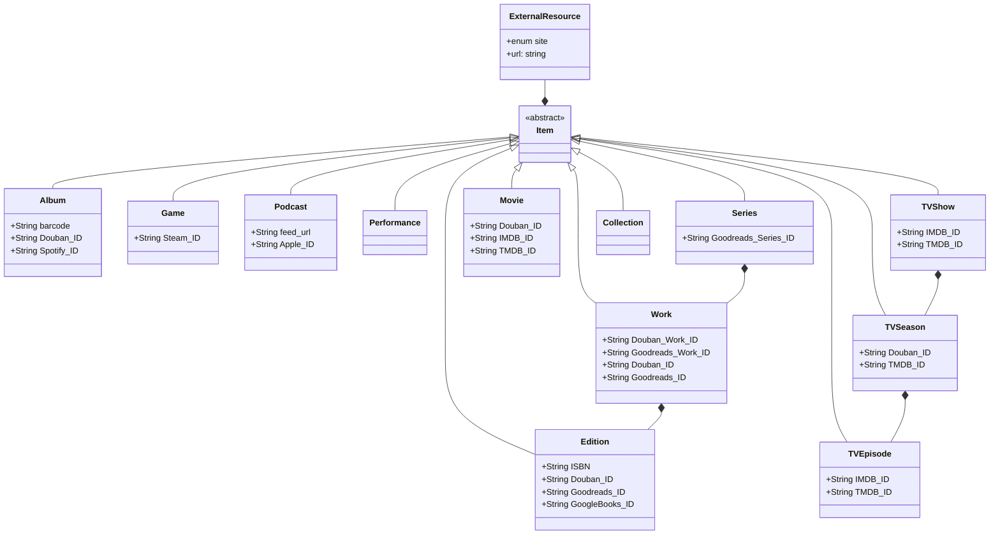

Catalog
=======

Data Models
-----------
all types of catalog items inherits from `Item` which stores as multi-table django model.
one `Item` may have multiple `ExternalResource`s, each represents one page on an external site

Add a new site
--------------
> **Site official API** should be the prioritised way to get data when adding a new site.
 - add a new value to `IdType` and `SiteName` in `catalog/common/models.py`
 - add a new file in `catalog/sites/`, a new class inherits `AbstractSite`, with:
    * `SITE_NAME`
    * `ID_TYPE`
    * `URL_PATTERNS`
    * `WIKI_PROPERTY_ID` (not used now)
    * `DEFAULT_MODEL` (unless specified in `scrape()` return val)
    * a classmethod `id_to_url()`
    * a method `scrape()` returns a `ResourceContent` object
      * `BasicDownloader` or `ProxiedDownloader` can used to download website content or API data. e.g. `content = BasicDownloader(url).download().html()`
    * ...

    see existing files in `catalog/sites/` for more examples
 - add an import in `catalog/sites/__init__.py`
 - add some tests to `catalog/<folder>/tests.py` according to site type
     + add `DOWNLOADER_SAVEDIR = '/tmp'` to `settings.py` can save all response to /tmp
     + run `python3 manage.py cat <url>` for debugging or saving response file to `/tmp`. Detailed code of `cat` is in `catalog/management/commands/cat.py`
     + move captured response file to `test_data/`, except large/images files. Or if have to, use a smallest version (e.g. 1x1 pixel / 1s audio)
     + add `@use_local_response` decorator to test methods that should pick up these responses (if `BasicDownloader` or `ProxiedDownloader` is used)
 - run all the tests and make sure they pass
   - Command: `python3 manage.py test [--keepdb]`. More detailed for `test`, please check [this doc](https://github.com/neodb-social/neodb/blob/main/doc/development.md#run-test)
   - See [this issue](https://github.com/neodb-social/neodb/issues/5) if `lxml.etree.ParserError` occurs on macOS.
 - add a site UI label to `common/static/scss/_sitelabel.scss`

