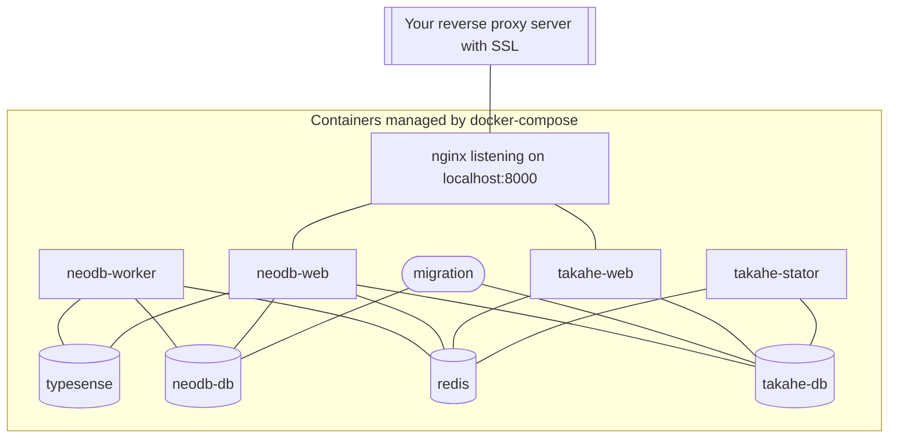

Run NeoDB in Docker
===================

## Overview
For small and medium NeoDB instances, it's recommended to deploy as a local container cluster with Docker Compose. If you are running a large instance, please see the bottom of doc for some tips.



As shown in the diagram, a reverse proxy server (e.g. nginx, or Cloudflare tunnel) will be required, it should have SSL configured and pointing to `http://localhost:8000`; the rest is handled by `docker compose` and containers.

## Install Docker and add user to docker group

Follow [official instructions](https://docs.docker.com/compose/install/) to install Docker Compose.

Note: Docker Compose V1 is no longer supported. Please verify its version before next step:
```
$ docker compose version
```

To run neodb as your own user (e.g. `neouser`), add them to docker group:
```
$ sudo usermod -aG docker neouser
```

## Get configuration files
 - create a folder for configuration, eg ~/neodb/config
 - grab `docker-compose.yml` and `neodb.env.example` from source code
 - rename `neodb.env.example` to `.env`

## Set up .env file
Change essential options like `NEODB_SITE_DOMAIN` in `.env` before starting the cluster for the first time. Changing them later may have unintended consequences, please make sure they are correct before exposing the service externally.

- `NEODB_SITE_NAME` - name of your site
- `NEODB_SITE_DOMAIN` - domain name of your site
- `NEODB_SECRET_KEY` - encryption key of session data
- `NEODB_DATA` is the path to store db/media/cache, it's `../data` by default, but can be any path that's writable

See `neodb.env.example` and `configuration.md` for more options

## Start docker
in the folder with `docker-compose.yml` and `neodb.env`, execute as the user you just created:
```
$ docker compose pull
$ docker compose --profile production up -d
```

In a minute or so, the site should be up at 127.0.0.1:8000 , you may check it with:
```
$ curl http://localhost:8000/nodeinfo/2.0/
```

JSON response will be returned if the server is up and running:
```
{"version": "2.0", "software": {"name": "neodb", "version": "0.8-dev"}, "protocols": ["activitypub", "neodb"], "services": {"outbound": [], "inbound": []}, "usage": {"users": {"total": 1}, "localPosts": 0}, "openRegistrations": true, "metadata": {}}
```

## Make the site available publicly

Next step is to expose `127.0.0.1:8000` to external network as `https://yourdomain.tld` . There are many ways to do it, you may use nginx as a reverse proxy with a ssl cert, or configure a CDN provider to handle the SSL. There's no detailed instruction yet but contributions are welcomed.

NeoDB requires `https` by default. Although `http` may be technically possible, it's tedious to set up and not secure, hence not recommended.

## Update NeoDB

Check the release notes, update `docker-compose.yml` and `.env` as instructed. pull the image
```
docker compose pull
```

If there's no change in `docker-compose.yml`, restart only NeoDB services:
```
$ docker compose stop neodb-web neodb-worker neodb-worker-extra takahe-web takahe-stator nginx
$ docker compose --profile production up -d
```

Otherwise restart the entire cluster:
```
$ docker compose down
$ docker compose --profile production up -d
```

## Troubleshooting

 - `docker compose ps` to see if any service is down, (btw it's normal that `migration` is in `Exit 0` state)
 - `docker compose run shell` to run a shell into the cluster; or `docker compose run root` for root shell, and `apt` is available if extra package needed
 - see `Debug in Docker` in [development doc](development.md) for debugging tips

## Scaling

If you are running a high-traffic instance, spin up `NEODB_WEB_WORKER_NUM`, `TAKAHE_WEB_WORKER_NUM`, `TAKAHE_STATOR_CONCURRENCY` and `TAKAHE_STATOR_CONCURRENCY_PER_MODEL` as long as your host server can handle them.

Further scaling up with multiple nodes (e.g. via Kubernetes) is beyond the scope of this document, but consider run db/redis/typesense separately, and then duplicate web/worker/stator containers as long as connections and mounts are properly configured; `migration` only runs once when start or upgrade, it should be kept that way.
