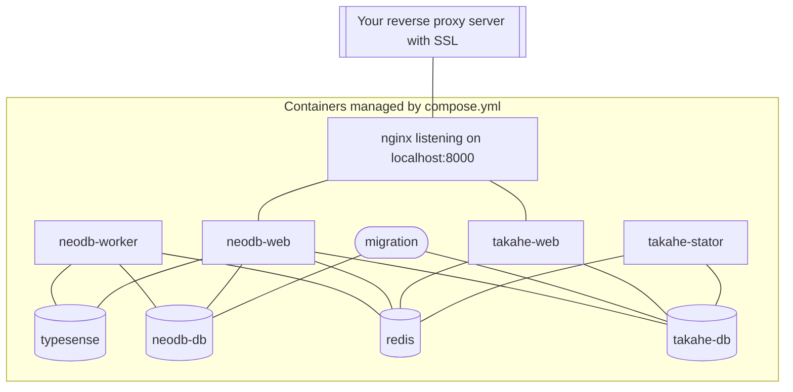

# Troubleshooting


## Tips

 - `docker compose ps` to see if any service is down, (btw it's normal that `migration` is in `Exit 0` state)
 - `docker compose run shell` to run a shell into the cluster; or `docker compose run root` for root shell, and `apt` is available if extra package needed
 - see `Debug in Docker` in [development doc](development.md) for debugging tips


## Containers

a typical neodb cluster looks like:




## Data Folders

a typical neodb folder after starting up should look like:

```
mysite
├── data                # neodb data folder, location can be changed via NEODB_DATA in .env
│   ├── neodb-db        # neodb database
│   ├── neodb-media     # uid must be 1000 (app user in docker image), chmod if not so
│   ├── redis           # neodb/takahe cache
│   ├── takahe-cache    # uid must be 33 (www-data user in docker image), chmod if not so
│   ├── takahe-db       # neodb database
│   ├── takahe-media    # uid must be 1000 (app user in docker image), chmod if not so
│   ├── typesense       # neodb search index
│   └── www-root        # neodb web root for robots.txt, logo.png and etc
└── config
    ├── compose.yml     # copied from neodb release
    └── .env            # your configuration, see neodb.env.example
```
